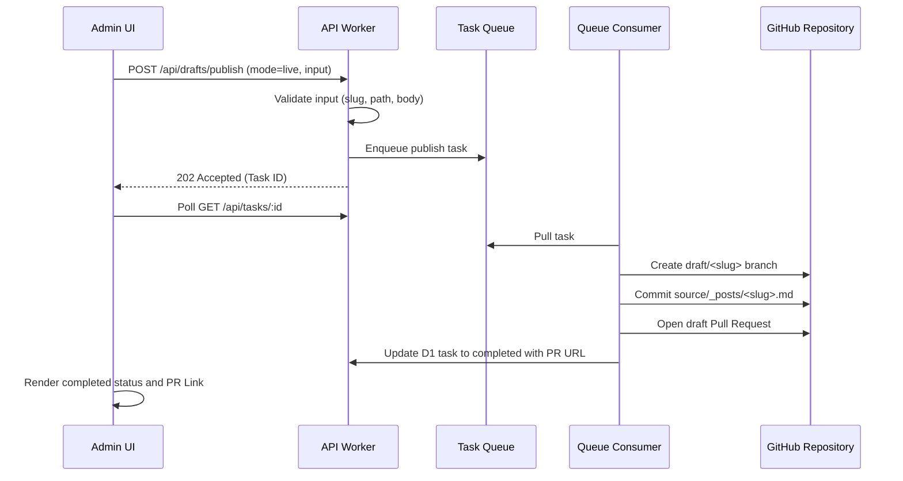

# Admin PR-only Publishing MVP

This document describes the design, fields, publish flow, and safety boundaries of the **Admin PR-only Publishing MVP** in `xhalo-blog`.

---

## 1. Scope & Purpose

The Admin PR-only Publishing MVP provides a secure content-management workspace where operators can draft articles, preview content formatting, and submit publication requests. 

To ensure maximum safety, **all write actions strictly generate Git Pull Requests for manual review**. No action on the admin panel will directly push commits to `main`, execute auto-merges, or publish live content automatically.

---

## 2. UI Fields & Metadata

The workspace is organized into four core functional sections:

### 2.1 Editor Panel
- **Title**: The title of the article.
- **Slug**: URL-friendly identifier. Must consist of only lowercase alphanumeric characters and hyphens, and cannot start or end with a hyphen.
- **Summary**: Concise description of the article, serialized into the post frontmatter.
- **Body (Markdown)**: The complete Markdown body text.

### 2.2 Frontmatter Panel
- **Date**: The publication date in ISO 8601 format (defaults to the creation timestamp).
- **Updated**: The last updated date in ISO 8601 format.
- **Categories**: Comma-separated categories (e.g. `notes, news`).
- **Tags**: Comma-separated tags (e.g. `cloudflare, stage4`).
- **Status**: Target publish status dropdown:
  - `draft`: The post is created as a draft and is not visible on lists unless filtered.
  - `review`: The post is ready for public review.

### 2.3 Preview Panel
- **Target Path Preview**: Displays where the file will be written (e.g. `source/_posts/<slug>.md`).
- **Frontmatter Preview**: Renders the serialized frontmatter metadata.
- **Markdown Preview**: Renders a safe HTML preview of the body content.

### 2.4 Task / PR Status Panel
- **Task ID**: Unique idempotency task identifier in D1.
- **Task Status**: `queued` / `processing` / `completed` / `failed`.
- **Branch**: Target Git branch name (e.g. `draft/<slug>`).
- **PR URL**: Clickable link to the generated GitHub Pull Request.
- **Last Error**: Diagnostic error messages for failed runs.
- **Timestamp**: Task creation and update times.

---

## 3. PR-only Publish Flow

---

## 4. Safety & Security Boundaries

### 4.1 Prohibited Actions
- **No Direct Main Commits**: Committing directly to `main` is completely blocked.
- **No Auto-Merge**: Pull Requests must be reviewed and merged manually by the repository owner.
- **No Unattended Live Writes**: The default system configuration maintains `LIVE_WRITES_ENABLED=false` at all times.
- **No Secret Exposure**: Secret tokens, credentials, private keys, or internal staging worker URLs are redacted from all user logs and D1 transaction tables.

### 4.2 Data & Path Validation
- **Path Traversal Rejection**: Paths containing `../`, `..\`, or absolute folders are rejected.
- **Post Folder Gating**: All files are written strictly under the `source/_posts/` folder.
- **Slug Constraints**: Non-conforming slugs are caught on submit and rejected.

---

## 5. Owner Review Workflow

When a Pull Request is successfully generated, the owner must manually verify the following before merging:

1. **Title and Frontmatter**: Confirm the metadata inside `source/_posts/<slug>.md` has valid headers.
2. **Post Content**: Verify the formatting and markdown structures are safe.
3. **No Code Mutations**: Ensure that only markdown files inside the posts directory are changed.
4. **Action**: Merge the PR manually on the GitHub UI or command line, or close it without merge if publication is cancelled.
