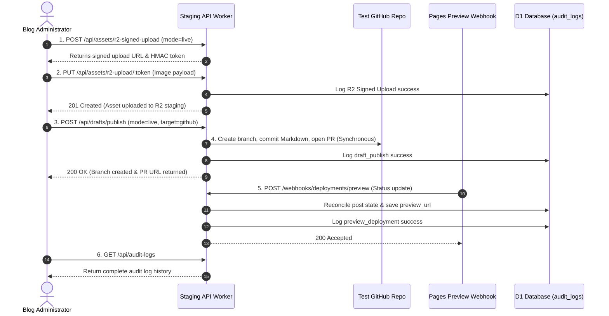
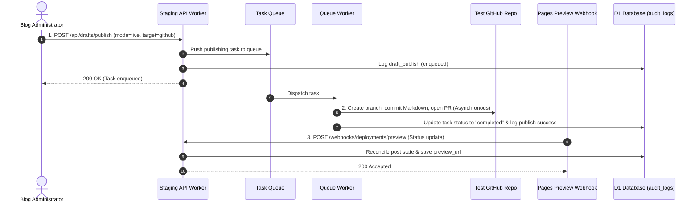

# Staging Live-Write Closed-Loop Verification

This document details the verification plan and steps to execute a controlled, live-write closed-loop validation of the publishing and asset upload pipeline using staging-only Cloudflare resources and an isolated test GitHub repository.

---

## Current Implementation Boundary

As of `v0.1.0-alpha.0`:
- **Synchronous API Execution**: The HTTP API Worker (`workers/api`) owns and directly executes request validation, GitHub API helper functions (including token generation, branch creation, file commits, and Pull Requests), R2 signed upload handling, webhook reconciliation, and D1 audit logging.
- **Queue Worker Scaffolding**: The Queue Worker (`workers/queue`) currently provides background task reconciliation scaffolding only. It does *not* execute the GitHub API publishing logic.
- **Testing Live-Writes**: Live-write publishing verification runs synchronously through the API Worker paths (which is how PR #39 was validated). Full async publishing via the Queue Worker is deferred to Phase 7.1.

---

## 1. Prerequisites & Environment State

To run the live-write tests, the Cloudflare staging API Worker must be configured in the Cloudflare dashboard (or via local secrets) with the following environment variables:

```bash
LIVE_WRITES_ENABLED=true
GITHUB_OWNER=ranbeioc
GITHUB_REPO=xhalo-blog-test
GITHUB_BRANCH=main
# Secrets (set via wrangler secret put or dashboard)
ADMIN_API_SHARED_SECRET=your-admin-shared-secret
ASSETS_SIGNING_SECRET=your-secret
GITHUB_WEBHOOK_SECRET=dummy-github-webhook-secret
PREVIEW_WEBHOOK_SECRET=dummy-preview-webhook-secret
GITHUB_APP_ID=...
GITHUB_INSTALLATION_ID=...
GITHUB_APP_PRIVATE_KEY=<placeholder>
```

Verify that the readiness API (`GET /api/readiness`) reports `status: "ready"` or `status: "partial"` (for live writes) across all active components.

---

## 2. Step-by-Step Live Loop Verification

### 2.1 Current Synchronous Staging Path (API Worker Direct Write)



### 2.2 Future Asynchronous Target (Queue Worker async publish - Phase 7.1)



---

## 3. API Request and Response Verification Templates

### Test A: R2 Signed Upload Loop

#### 1. Request Signed Upload Plan
- **Method**: `POST`
- **Path**: `/api/assets/r2-signed-upload`
- **Headers**:
  ```http
  x-xhalo-admin-secret: your-admin-shared-secret
  cf-turnstile-token: dummy-token
  content-type: application/json
  ```
- **Body**:
  ```json
  {
    "filename": "hello-world.png",
    "contentType": "image/png",
    "scope": "global",
    "mode": "live",
    "ttlSeconds": 120
  }
  ```

#### 2. Execute Asset Upload PUT
- **Method**: `PUT`
- **Path**: `/api/assets/r2-upload/<signed-token-string>`
- **Headers**:
  ```http
  content-type: image/png
  ```
- **Body**: *Raw binary image data (less than 1 MiB)*

#### 3. Expected Outcomes
- **PUT Response**: `201 Created` with payload:
  ```json
  {
    "mode": "signed-upload",
    "objectKey": "uploads/global/hello-world.png",
    "publicUrl": "https://assets-staging.example.com/uploads/global/hello-world.png"
  }
  ```
- **Audit Log Entry**: Check `audit_logs` has action `r2_signed_upload` for resource `asset` with `resource_id = uploads/global/hello-world.png` and `status_code = 201`.

---

### Test B: GitHub Publishing Loop

#### 1. Request Draft Publish
- **Method**: `POST`
- **Path**: `/api/drafts/publish`
- **Headers**:
  ```http
  x-xhalo-admin-secret: your-admin-shared-secret
  cf-turnstile-token: dummy-token
  content-type: application/json
  ```
- **Body**:
  ```json
  {
    "title": "Staging Live Closed-Loop Verification Post",
    "slug": "staging-live-closed-loop-verification-post",
    "body": "---\ntitle: Staging Live Closed-Loop Verification Post\ndate: 2026-06-08\n---\n\nThis is a live test article published via the staging closed-loop pipeline.",
    "mode": "live",
    "publish_target": "github"
  }
  ```

#### 2. Expected Outcomes
- **API Response**: `200 OK` with enqueued task metadata.
- **Test Repository PR**:
  - A branch named `drafts/staging-live-closed-loop-verification-post` is created.
  - A commit adding `source/_posts/2026-06-08-staging-live-closed-loop-verification-post.md` is pushed.
  - A Pull Request into `main` is opened by the GitHub App.
- **Idempotency Check**: Re-running the identical publish request returns `200 OK` and references the **same** Pull Request URL (no duplicate PRs created).
- **Audit Log Entry**: Check `audit_logs` has action `draft_publish` for resource `post` with `resource_id = staging-live-closed-loop-verification-post`.

---

### Test C: Preview Webhook Reconciliation Loop

#### 1. Dispatch Mock Preview Webhook
- **Method**: `POST`
- **Path**: `/webhooks/deployments/preview`
- **Headers**:
  ```http
  x-preview-webhook-secret: dummy-preview-webhook-secret
  content-type: application/json
  ```
- **Body**:
  ```json
  {
    "branchName": "drafts/staging-live-closed-loop-verification-post",
    "postSlug": "staging-live-closed-loop-verification-post",
    "previewUrl": "https://preview-post-1234.pages.dev",
    "provider": "cloudflare-pages",
    "status": "preview-ready"
  }
  ```

#### 2. Expected Outcomes
- **API Response**: `200 OK`
- **D1 posts_index Update**: Querying `/api/posts` returns the post with `status = "preview-ready"` and `preview_url = "https://preview-post-1234.pages.dev"`.
- **Audit Log Entry**: Check `audit_logs` has action `preview_deployment` for resource `deployment` with `resource_id = staging-live-closed-loop-verification-post`.

---

### Test D: Boundary Constraint Enforcement

Verify the following security boundary rejections:

| Test Scenario | Action | Payload | Expected Status | Error Message / Pattern |
|---|---|---|---|---|
| Access Block | `GET /api/posts` | No admin header | `401` | `Unauthorized admin API request.` |
| Turnstile Block | `POST /api/drafts/publish` | Missing turnstile header | `403` | `Turnstile verification failed.` |
| MIME Limit Block | `POST /api/assets/r2-preview` | `test.exe` / `application/octet-stream` | `400` | `MIME type 'application/octet-stream' is not allowed.` |
| Path Traversal Block | `POST /api/assets/r2-preview` | `../hello.png` / `image/png` | `400` | `Filename contains invalid path traversal characters.` |
| Payload Size Block | `PUT /api/assets/r2-upload/:token` | 2 MiB payload file | `413` | `Prototype signed uploads are limited to 1 MiB.` |
| GitHub Signature Block | `POST /webhooks/github` | Bad signature header | `403` | `GitHub webhook signature mismatch.` |

---

## 4. Rollback & Staging Clean-Up Guide

After verification is complete, clean up the testing artifacts:
1. **GitHub Repository**: Close the created Pull Request and delete the `drafts/staging-live-closed-loop-verification-post` branch in the `<owner>/<test-repo>` repository.
2. **R2 Bucket**: Delete the uploaded object `uploads/global/hello-world.png` in the `xhalo-blog-staging-assets` bucket.
3. **D1 Database**: Run clean-up commands to remove test database records:
   ```sql
   DELETE FROM posts_index WHERE slug = 'staging-live-closed-loop-verification-post';
   DELETE FROM tasks WHERE payload LIKE '%staging-live-closed-loop-verification-post%';
   ```
4. **Disable Live Writes**: Revoke the `LIVE_WRITES_ENABLED=true` variable in your Cloudflare staging Worker dashboard (reset it to `false`).
