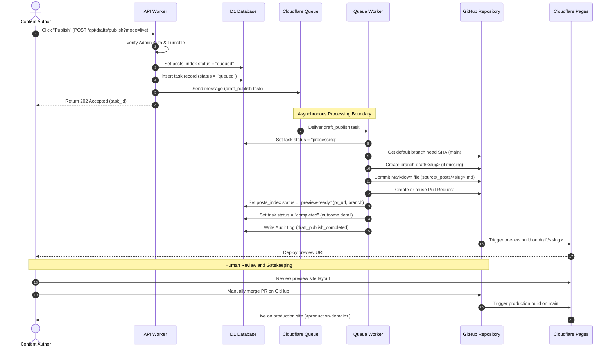

# Production PR Generator Mode (Level 2)

This document details the architecture, data flow, and operational processes for **Level 2: PR Generator Mode**, the recommended integration baseline for connecting `xhalo-blog` to the production site.

---

## Architectural Principle

The fundamental security principle of PR Generator Mode is the **Separation of Content Drafting from Production Deployment**. 

No content managed within the `xhalo-blog` Admin panel is published directly to the live production environment. Instead, `xhalo-blog` serves as an authoring workstation that generates standard Git commits on isolated branches and opens pull requests, leveraging existing repository protection policies and CI/CD pipelines (e.g., Cloudflare Pages) for review and deployment.

---

## End-to-End Workflow

The following diagram illustrates the sequence of actions when publishing a draft under Level 2:

---

## Technical Flow Steps

### 1. Request Ingestion & Queueing
* The API Worker receives the publish request at `POST /api/drafts/publish` with `mode=live` and `publish_target=github` (default).
* The request is authenticated via Cloudflare Access JWT or the shared Admin token, and Turnstile token.
* A task of type `draft_publish` is created.
* The API Worker performs a database write to transition the post's index status to `queued`.
* The task is sent to `TASK_QUEUE` (Cloudflare Queues), and the API immediately responds with `202 Accepted` to keep the UI responsive.

### 2. Async Queue Processing
* The Queue Worker polls messages from the queue and handles the `draft_publish` task.
* The task status is updated in D1 to `processing`.
* The worker authenticates with GitHub using the configured GitHub App credentials (exchanging the JWT for an installation token) or falls back to a Personal Access Token (`GITHUB_TOKEN`).
* The worker queries the repository for the default branch head (`main`) and creates a new branch named `draft/<slug>` if it does not already exist.

### 3. File Commit and Pull Request Creation
* The Queue Worker compiles the post data into a Hexo-compatible Markdown document containing YAML front-matter and content.
* The file is committed to the path `source/_posts/<slug>.md` on the `draft/<slug>` branch. If the branch already exists, it fetches the existing file's SHA to perform an update, preventing conflicts.
* The worker creates a Pull Request to merge `draft/<slug>` into `main`.
* If a PR is already open for this branch, the worker gracefully searches for it and reuses the existing PR reference rather than throwing an error (ensuring idempotency).

### 4. Database Reconciliation and Audit Logging
* Upon successful PR creation, the worker updates the post's index status to `preview-ready` in D1 and attaches the `github_pr_url` and `github_branch`.
* The task record is marked as `completed`.
* An audit log entry is written to `audit_logs` with action `draft_publish_completed`.
* If any step fails (e.g., GitHub API timeout, commit conflict, network issue), the post's index status is updated to `failed`, the task is marked as `failed`, and `draft_publish_failed` is logged with details of the error.

### 5. Deployment and Verification
* GitHub notifies Cloudflare Pages of the new branch push.
* Cloudflare Pages builds the staging/preview site and exposes the preview URL.
* The author reviews the preview. Once validated, they manually merge the PR on GitHub.
* Merging to `main` triggers the live production deploy of `<production-domain>`.

---

## Key Safety Constraint: Live Writes Default Disabled

To prevent accidental writes during local development or staging verification:
* The environment variable `LIVE_WRITES_ENABLED` **must** default to `false` in all template configurations and code paths.
* When `LIVE_WRITES_ENABLED=false`, the API Worker blocks any publishing attempts with `mode=live`, returning a `403 Forbidden` response.
* Enabling Level 2 PR Generator Mode in production requires explicitly setting `LIVE_WRITES_ENABLED=true` in the production Cloudflare Wrangler environment dashboard.
